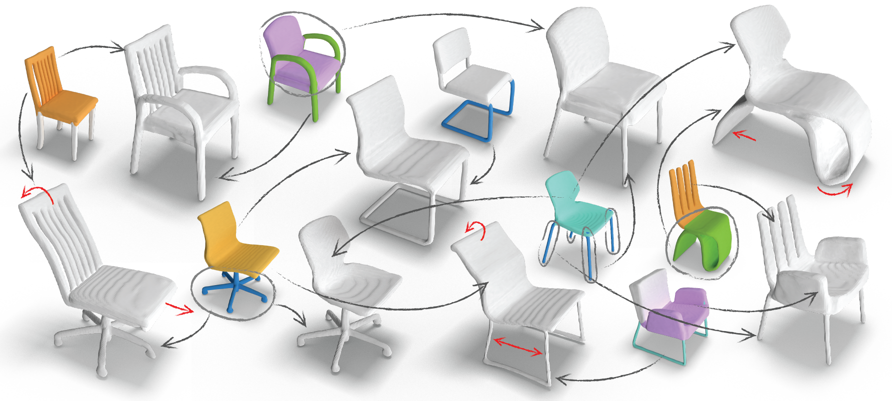

### [SPAGHETTI: Editing Implicit Shapes through Part Aware Generation]("https://amirhertz.github.io/spaghetti")




### Installation

```
git clone https://github.com/amirhertz/spaghetti && cd spaghetti
conda env create -f environment.yml
conda activate spaghetti
```

Install [Pytorch](https://pytorch.org/). The installation during development and testing was pytorch==1.9.0  cudatoolkit=11.1 


### Demo
- Download pre-trained models
```
python download_weights.py
```
- Run demo 
```
python demo.py --model_name chairs_large --shape_dir samples
```
or
```
python demo.py --model_name airplanes --shape_dir samples
```

- User controls
  - Select shapes from the collection on bottom.
  - right click to select / deselect parts
  - Click the pencil button will toggle between selection /  deselection.
  - Transform selected parts is similar to Blender short-keys.
  Pressing 'G' / 'R', will start translation / rotation mode. Toggle axis by pressing 'X' / 'Y' / 'Z'. Press 'Esc' to cancel transform.
  - Click the broom to reset.
  

### Adding shapes to demo
- From training data
```
python shape_inversion.py --model_name  <model_name>  --source training --mesh_path --num_samples <num_samples>
```
- Random generation
```
python shape_inversion.py --model_name  <model_name>  --source random --mesh_path --num_samples <num_samples>
```
- From existing watertight mesh: 
```
python shape_inversion.py --model_name  <model_name>  --mesh_path <mesh_path>
```
For example, to add the provided sample chair to the exiting chairs in the demo: 
```
python shape_inversion.py --model_name chairs_large --mesh_path ./assets/mesh/example.obj
```

### Training
Coming soon.

